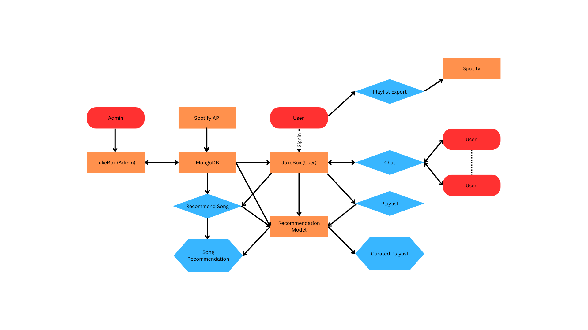

# 🎧 JukeBox – Music Recommendation & Playlist Sharing Platform

JukeBox is a web-based music discovery and playlist-sharing app that helps users explore new tracks based on their music taste. With a few favorite songs as input, users receive personalized recommendations powered by Spotify data. They can create, manage, and export playlists, chat with others, and build a social music experience online.

---

## 📌 Features

- 🎵 Mood-based and taste-based song recommendations  
- 📂 Custom playlist creation and management  
- 🔄 Export playlists to Spotify (via Spotify account linking)  
- 💬 Real-time chat with other users (group chat support)  
- 🛠️ Admin dashboard for user and content management  
- 🔐 User authentication (login/signup)

---

## ⚙️ Tech Stack

**Frontend**  
- HTML5  
- CSS3  
- [Materialize CSS](https://materializecss.com/) for UI components and responsive design

**Backend**  
- Node.js & Express.js  
- RESTful API (MVC architecture)  
- WebSocket for real-time chat

**Database**  
- MongoDB (NoSQL)

**Others**  
- Spotify API for song data and playlist integration  
- Docker for containerization (in development and deployment)

---

## 🚀 Getting Started

### Prerequisites
- Node.js & npm
- Git
- MongoDB (local or cloud)
- Docker (optional, for containerized setup)

### Installation

```bash
git clone https://github.com/Blitz17/Music-Recommendation 
npm install
```

### Setup
This is for installation of all modules
```bash
node jukebox-backend/setup.js
```

### Running
Run the below command in one terminal
```bash
npm start
```
# or
```bash
node jukebox-backend/server.js
```

and the below command in another one
```bash
python jukebox-backend/recom_model/app.py
```
In total you will have 2 servers running

## 📡 API Endpoints
---
**🎵 Recommendation API (http://localhost:5000)**

<!-- ---

```bash
POST /api/recommend
```

Get song recommendations based on input songs and model type.
Request Body:
```bash
{
  "songs": ["song1", "song2"],
  "model_type": "song"  // or "playlist"
}
```
Response 200: 
```bash
{
  "recommendations": [
    {
      "track_name": "string",
      "track_id": "string",
      "artists": "string",
      "track_genre": "string"
    }
  ]
}
```
Errors:
400: Bad request (missing or invalid inputs)
500: Recommendation error

---

```bash
POST /api/song_details
```

Get detailed metadata for given track IDs.
Request Body:
```bash
{
  "track_ids": ["123abc", "456def"]
}
```
Response 200: 
```bash
[
  {
    "track_id": "string",
    "title": "string",
    "artist": "string",
    "album": "string",
    "duration": "string",
    "image": "string"
  }
]

```
Errors:
400: Bad request
500: Song Details error

--- -->

**📂 Playlist API (http://localhost:3000/api)**

<!-- ---

```bash
GET /playlists
```

Get all playlists.
Response 200: 
```bash
[
  {
    "_id": "string",
    "playlist_name": "string",
    "songs": [
      {
        "track_id": "string",
        "title": "string",
        "artist": "string",
        "album": "string",
        "duration": "string",
        "image": "string"
      }
    ],
    "createdAt": "date-time",
    "updatedAt": "date-time"
  }
]

```
Errors:
500 Server error

---

```bash
POST /api/recommend
```

Get song recommendations based on input songs and model type.
Request Body:
```bash
{
  "songs": ["song1", "song2"],
  "model_type": "song"  // or "playlist"
}
```
Response 200: 
```bash
{
  "recommendations": [
    {
      "track_name": "string",
      "track_id": "string",
      "artists": "string",
      "track_genre": "string"
    }
  ]
}
```
Errors:
400: Bad request (missing or invalid inputs)
500: Recommendation error

--- -->



